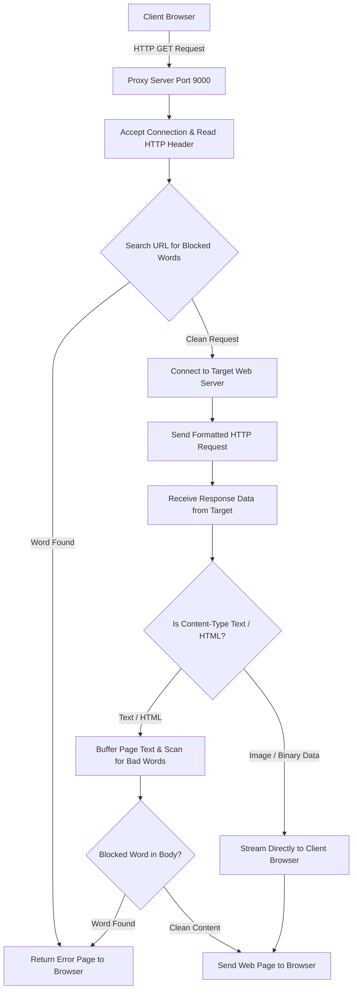

# Simple HTTP Proxy Server in C++

> **GitHub Repository Description**: An HTTP forward proxy server in C++ that intercepts web requests, formats HTTP headers, and filters blocked keywords in URLs and HTML content.

An HTTP proxy server written in C++ for Linux using network socket APIs. The proxy acts as an intermediary between a web browser and destination web servers, allowing it to inspect incoming requests and block pages containing forbidden words.

---

## How It Works

When a browser sends an HTTP request through the proxy, the proxy parses the destination host, checks for blocked words, forwards the request to the target website, and inspects the response payload before returning it to the user.



---

## What It Can Do

- HTTP Request Proxying: Intercepts and parses HTTP `GET` requests, extracting target hostnames to establish outbound connections.
- HTTP Header Formatting: Modifies incoming HTTP headers to match what origin web servers expect (such as setting the correct `Host` header).
- Keyword Filtering: Accepts a list of blocked words as command-line arguments. It checks both the requested URL and the web page content.
- Smart Media Streaming: Scans plain text and HTML pages for blocked keywords, but streams images and binary data directly so media files don't break.
- Reliable Data Transmission: Uses custom socket write loops (`SendAll`) to make sure complete TCP packets are delivered without data loss.

---

## Project Files

- `Makefile`: Build automation script.
- `src/Proxy.h`: Class definition, socket utility methods, and word-filtering function declarations.
- `src/Proxy.cc`: Main implementation of the proxy server including socket listening, target server connections, header parsing, and keyword scanning.
- `src/main.cc`: Command-line entry point that parses arguments (port number and blocked words) and starts the server.

---

## How to Build and Run

### Requirements
- C++ compiler (`g++` or `clang++`)
- Make utility
- Linux, macOS, or WSL

### Compilation
Build the project using `make`:
```bash
make
```
This will compile the project and generate an executable named `proxy`.

### Running the Proxy
Run the binary and specify a port number and optional blocked words:

```bash
# General syntax:
./proxy <port> [blocked_word1] [blocked_word2] ...

# Example: Run on port 9000 blocking specific words
./proxy 9000 spongebob secret badword

# Example: Run on port 9000 without keyword filtering
./proxy 9000
```

### Configuring Your Web Browser (e.g., Firefox)
1. Go to Firefox Settings -> Network Settings.
2. Select Manual proxy configuration.
3. Set HTTP Proxy to `127.0.0.1` and Port to `9000` (or whichever port you configured).
4. Leave HTTPS and SOCKS proxy fields empty.

---

## Current Limitations

- HTTP Only: Only supports plain HTTP `GET` requests (does not handle HTTPS encrypted traffic or `POST` submissions).
- Blocking Architecture: Handles connections sequentially in a single-threaded loop, so requests are processed one at a time.
- Memory Overhead: Loads entire HTML pages into memory at once to scan for blocked words.
- No Web Caching: Does not cache web pages locally to speed up repeated requests.
